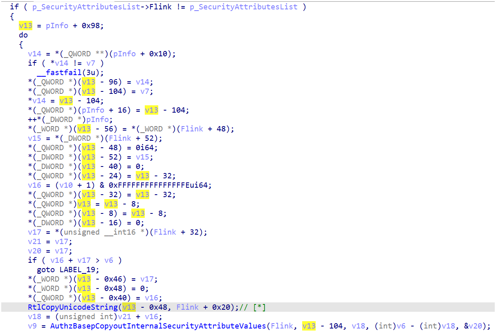

# CVE-2024-30088

## Bug:

- Bug is inside function *AuthzBasepCopyoutInternalSecurityAttributes* when kernel copies the **_AUTHZBASEP_SECURITY_ATTRIBUTES_INFORMATION** of current token object to user mode, which has structure like this:
```
//0x30 bytes (sizeof)
struct _AUTHZBASEP_SECURITY_ATTRIBUTES_INFORMATION
{
    ULONG SecurityAttributeCount;                                           //0x0
    struct _LIST_ENTRY SecurityAttributesList;                              //0x8
    ULONG WorkingSecurityAttributeCount;                                    //0x18
    struct _LIST_ENTRY WorkingSecurityAttributesList;                       //0x20
}; 
```

- When performing copy the **SecurityAttributesList**, the kernel setup the list of SecurityAttribute's structure \**directly*\* to the user supplied pointer. After that, it calls to *RtlCopyUnicodeString* and *AuthzBasepCopyoutInternalSecurityAttributeValues* functions to copy out name and value of the SecurityAttribute structure, leading to multiple TOCTOU in this function.

- With a simple racing thread to modify the **Buffer** pointer of the attribute name before *RtlCopyUnicodeString* is called [*], I can easily archive an arbitrary address write with a fixed value and size controlled.



- Note that there are also some other ways to exploit it, but in my case, I chose to utilize the *RtlCopyUnicodeString*.


## Trigger bug:

- This bug can be easily triggered by calling the *NtQueryInformationToken* with **TokenAccesInformation** class.

## The patches:

- The patch uses a local variable on kernel stack (**v18** in code block below) as a buffer to copy the security attribute's name(s) before writing back to user buffer if the syscall is from usermode.

```
    [...]
        p_SecurityAttributesList = &a1->SecurityAttributesList;
        Flink = a1->SecurityAttributesList.Flink;
        if ( Flink == p_SecurityAttributesList )
          return (unsigned int)inserted;
        v13 = a2 + 0x98;
        while ( 1 )
        {
          if ( (unsigned int)Feature_2516935995__private_IsEnabledDeviceUsage() )
          {
            inserted = AuthzBasepProbeAndInsertTailList(a2 + 8, v13 - 0x68);
            if ( inserted < 0 )
              goto LABEL_24;
          }
          else
          {
            [...]
          }
          ++*(_DWORD *)a2;
          *(_WORD *)(v13 - 56) = Flink[3].Flink;
          *(_DWORD *)(v13 - 52) = HIDWORD(Flink[3].Flink);
          *(_QWORD *)(v13 - 24) = v13 - 32;
          *(_QWORD *)(v13 - 32) = v13 - 32;
          *(_QWORD *)v13 = v13 - 8;
          *(_QWORD *)(v13 - 8) = v13 - 8;
          *(_QWORD *)(v13 - 48) = 0i64;
          *(_DWORD *)(v13 - 40) = 0;
          *(_DWORD *)(v13 - 16) = 0;
          Flink_low = LOWORD(Flink[2].Flink);
          v19 = Flink_low;
          v17 = (wchar_t *)((v10 + 1) & 0xFFFFFFFFFFFFFFFEui64);
          v15 = (unsigned __int64)v17 + Flink_low;
          if ( (unsigned __int64)v17 + Flink_low > v6 )
            break;
          if ( (unsigned int)Feature_3391791421__private_IsEnabledDeviceUsage() )
          {
            *(_QWORD *)&v18.Length = 0i64;
            v18.MaximumLength = Flink_low;
            v18.Buffer = v17;
            RtlCopyUnicodeString(&v18.Length, (unsigned __int16 *)&Flink[2]);
            *(_UNICODE_STRING *)(v13 - 0x48) = v18;
          }
          else
          {
            [...]
          }
          inserted = AuthzBasepCopyoutInternalSecurityAttributeValues(
                       (__int64)Flink,
                       v13 - 104,
                       v15,
                       (int)v6 - (int)v15,
                       &v19);
    [...]
```

- In the debug session, we can see the **rcx** is the kernel address after patch:

```
5: kd> 
nt!AuthzBasepCopyoutInternalSecurityAttributes+0x1aa:
fffff803`5dbcf14a e8810fa5ff      call    nt!RtlCopyUnicodeString (fffff803`5d6200d0)
5: kd> r
rax=0000025a81d006a0 rbx=0000025a81d00590 rcx=ffffe20697c4f778
rdx=ffffa609c7a101a0 rsi=0000025a81d00598 rdi=0000025a81d00628
rip=fffff8035dbcf14a rsp=ffffe20697c4f740 rbp=0000025a81d006c0
 r8=0000000000000003  r9=0000025a81d00590 r10=ffffa609c816ef78
r11=ffffe20697c4f7d0 r12=0000000000000a70 r13=ffffa609ca9b1118
r14=ffffa609c7a10180 r15=0000025a81d01000
iopl=0         nv up ei pl nz na pe nc
cs=0010  ss=0018  ds=002b  es=002b  fs=0053  gs=002b             efl=00040202
nt!AuthzBasepCopyoutInternalSecurityAttributes+0x1aa:
fffff803`5dbcf14a e8810fa5ff      call    nt!RtlCopyUnicodeString (fffff803`5d6200d0)
```

## POC:
- https://youtu.be/y5LnlHjzA64
